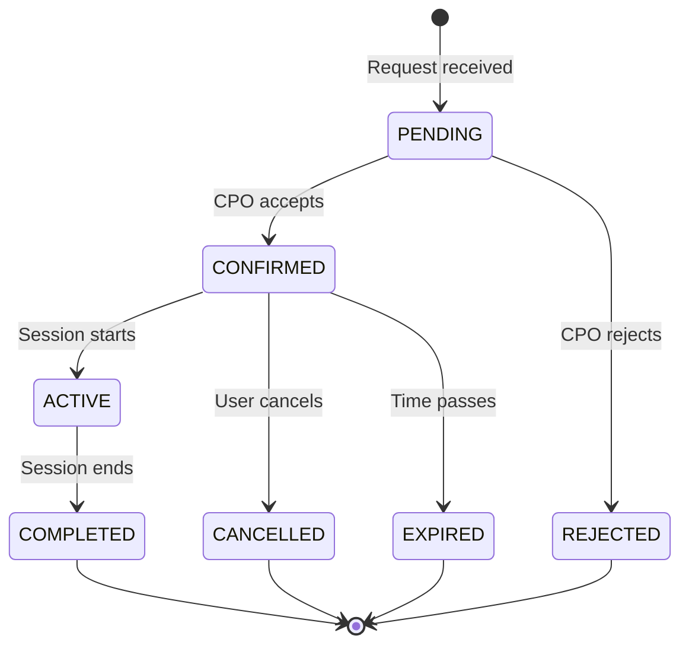

# Booking Reservations

This tutorial covers implementing EV charging reservations using the OCPI 2.3.0 Booking module.

!!! note "OCPI 2.3.0 Feature"
    The Booking module is new in OCPI 2.3.0. It allows EMSPs to reserve charging time slots at CPO charging stations.

## Overview

The Booking module enables:

- **Time slot reservations** - Reserve specific charging times in advance
- **Booking lifecycle management** - Track bookings from request to completion
- **Integration with sessions** - Convert confirmed bookings to charging sessions

## Booking States



| State | Description |
|-------|-------------|
| `PENDING` | Booking request received, awaiting CPO confirmation |
| `CONFIRMED` | CPO has confirmed the booking |
| `ACTIVE` | Charging session is in progress |
| `COMPLETED` | Booking completed successfully |
| `CANCELLED` | Booking was cancelled |
| `EXPIRED` | Booking expired without being used |
| `REJECTED` | CPO rejected the booking request |
| `FAILED` | Booking could not be fulfilled |

## Setting Up a Booking Application

### Basic CPO Setup

```python
from ocpi import get_application
from ocpi.core.enums import ModuleID, RoleEnum
from ocpi.modules.versions.enums import VersionNumber

app = get_application(
    version_numbers=[VersionNumber.v_2_3_0],
    roles=[RoleEnum.cpo],
    modules=[ModuleID.bookings],
    authenticator=MyAuthenticator,
    crud=MyBookingsCrud,
)
```

### Implementing the CRUD

```python
from datetime import UTC, datetime
from ocpi.core.crud import Crud
from ocpi.core.enums import ModuleID, RoleEnum
from ocpi.modules.bookings.v_2_3_0.enums import BookingState

class BookingsCrud(Crud):
    @classmethod
    async def get(cls, module: ModuleID, role: RoleEnum, id: str, *args, **kwargs):
        """Retrieve a booking by ID."""
        # Query your database for the booking
        return await database.get_booking(id)
    
    @classmethod
    async def list(cls, module: ModuleID, role: RoleEnum, filters: dict, *args, **kwargs):
        """List bookings with pagination."""
        # Apply filters (date_from, date_to, offset, limit)
        bookings = await database.list_bookings(
            date_from=filters.get("date_from"),
            date_to=filters.get("date_to"),
            offset=filters.get("offset", 0),
            limit=filters.get("limit", 50),
        )
        total = await database.count_bookings()
        is_last = filters.get("offset", 0) + len(bookings) >= total
        return bookings, total, is_last
    
    @classmethod
    async def create(cls, module: ModuleID, role: RoleEnum, data: dict, *args, **kwargs):
        """Process a booking request from an EMSP."""
        # Validate availability
        is_available = await check_availability(
            location_id=data["location_id"],
            evse_uid=data.get("evse_uid"),
            start_time=data["start_date_time"],
            end_time=data["end_date_time"],
        )
        
        if not is_available:
            return None  # Will result in REJECTED response
        
        # Create the booking
        booking = {
            "country_code": "DE",
            "party_id": "ELU",
            "id": generate_booking_id(),
            "emsp_booking_id": data["emsp_booking_id"],
            "token": data["token"],
            "location_id": data["location_id"],
            "evse_uid": data.get("evse_uid"),
            "connector_id": data.get("connector_id"),
            "start_date_time": data["start_date_time"],
            "end_date_time": data["end_date_time"],
            "state": BookingState.confirmed,
            "authorization_reference": data.get("authorization_reference"),
            "energy_estimate": data.get("energy_estimate"),
            "estimated_cost": calculate_estimated_cost(data),
            "status_message": [],
            "session_id": None,
            "last_updated": datetime.now(UTC).isoformat(),
        }
        
        await database.save_booking(booking)
        return booking
    
    @classmethod
    async def update(cls, module: ModuleID, role: RoleEnum, data: dict, id: str, *args, **kwargs):
        """Update a booking (e.g., change state)."""
        booking = await database.get_booking(id)
        if not booking:
            return None
        
        # Update allowed fields
        for key, value in data.items():
            if value is not None:
                booking[key] = value
        
        booking["last_updated"] = datetime.now(UTC).isoformat()
        await database.save_booking(booking)
        return booking
    
    @classmethod
    async def delete(cls, module: ModuleID, role: RoleEnum, id: str, *args, **kwargs):
        """Cancel a booking."""
        booking = await database.get_booking(id)
        if booking:
            booking["state"] = BookingState.cancelled
            booking["last_updated"] = datetime.now(UTC).isoformat()
            await database.save_booking(booking)
```

## API Endpoints

### CPO Endpoints (Receiver)

The CPO receives booking requests from EMSPs:

| Method | Endpoint | Description |
|--------|----------|-------------|
| GET | `/ocpi/cpo/2.3.0/bookings` | List all bookings |
| GET | `/ocpi/cpo/2.3.0/bookings/{id}` | Get specific booking |
| POST | `/ocpi/cpo/2.3.0/bookings` | Create new booking |
| PATCH | `/ocpi/cpo/2.3.0/bookings/{id}` | Update booking |
| DELETE | `/ocpi/cpo/2.3.0/bookings/{id}` | Cancel booking |

### EMSP Endpoints (Sender)

The EMSP can query and manage bookings:

| Method | Endpoint | Description |
|--------|----------|-------------|
| GET | `/ocpi/emsp/2.3.0/bookings/{country_code}/{party_id}` | List bookings |
| GET | `/ocpi/emsp/2.3.0/bookings/{country_code}/{party_id}/{id}` | Get booking |
| PUT | `/ocpi/emsp/2.3.0/bookings/{country_code}/{party_id}/{id}` | Add/update booking |
| PATCH | `/ocpi/emsp/2.3.0/bookings/{country_code}/{party_id}/{id}` | Partial update |
| DELETE | `/ocpi/emsp/2.3.0/bookings/{country_code}/{party_id}/{id}` | Delete booking |

## Example: Creating a Booking Request

An EMSP sends a booking request to a CPO:

```python
import httpx
import base64

# Prepare the token (Base64 encoded for OCPI 2.3.0)
token = base64.b64encode(b"my-emsp-token").decode()

# Booking request
booking_request = {
    "emsp_booking_id": "EMSP-REQ-001",
    "token": {
        "country_code": "DE",
        "party_id": "EMS",
        "uid": "RFID-12345678",
        "type": "RFID",
        "contract_id": "DE-EMS-C12345678-1",
        "valid": True,
        "whitelist": "ALWAYS",
        "last_updated": "2026-01-09T12:00:00Z",
    },
    "location_id": "LOC-BERLIN-001",
    "evse_uid": "EVSE-001",
    "connector_id": "CONN-001",
    "start_date_time": "2026-01-10T14:00:00Z",
    "end_date_time": "2026-01-10T16:00:00Z",
    "energy_estimate": 30.0,
}

# Send request
async with httpx.AsyncClient() as client:
    response = await client.post(
        "https://cpo.example.com/ocpi/cpo/2.3.0/bookings",
        json=booking_request,
        headers={"Authorization": f"Token {token}"},
    )
    
    result = response.json()
    if result["data"]["result"] == "ACCEPTED":
        booking = result["data"]["booking"]
        print(f"Booking confirmed: {booking['id']}")
    else:
        print(f"Booking rejected: {result['data']['message']}")
```

## Example: Updating Booking State

When a charging session starts, update the booking to ACTIVE:

```python
async def start_session_from_booking(booking_id: str, session_id: str):
    """Convert a booking to an active session."""
    await crud.update(
        ModuleID.bookings,
        RoleEnum.cpo,
        {
            "state": BookingState.active,
            "session_id": session_id,
        },
        booking_id,
    )
```

## Complete Working Example

See the [Bookings Example](../../examples/bookings/) for a complete, runnable application demonstrating:

- CPO booking receiver endpoints
- In-memory storage (easily replaceable with a database)
- Authentication handling for OCPI 2.3.0
- Full booking lifecycle management

## Best Practices

1. **Validate availability** - Always check EVSE availability before confirming bookings
2. **Handle conflicts** - Implement proper locking for concurrent booking requests
3. **Set timeouts** - Auto-expire bookings that aren't used within a grace period
4. **Link to sessions** - Store the `session_id` when a booking converts to a session
5. **Send notifications** - Notify EMSPs when booking states change

## Next Steps

- Review the [Sessions Tutorial](sessions.md) for integrating bookings with sessions
- Explore the [Commands Tutorial](commands.md) for START_SESSION commands
- Check the [API Reference](../api/v_2_3_0.md) for complete endpoint documentation
